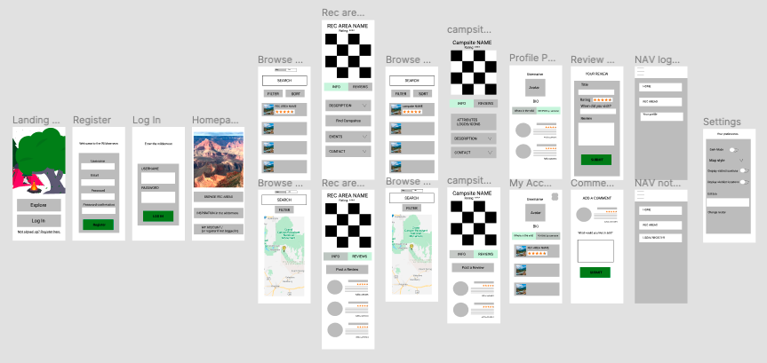

# Project 3

All credit to Ali Bhimani and Richard Bekoe for their imagination, skill, and support. Without them, this project would not have been.

## Contents

- [Contents](#contents)
- [Brief](#brief)
- [Approach](#approach)
- [Technologies Used](#technologies-used)
- [Wireframe](#wireframe)
- [Responsibilities](#responsibilities)
  - [Data Mining](#data-mining)
  - [SVG Animation](#svg-animation)
  - [Campground Page](#campground-page)
  - [React Context API](#react-context-api)
  - [Cloudinary](#cloudinary)
  - [User Preferences](#user-preferences)
- [Key Learnings](#key-learnings)
- [Achievements](#achievements)
- [Challenges](#challenges)
- [Conclusions](#conclusions)

## Brief

Build a full-stack MERN web application and deploy to Heroku. Use an Express API to serve data from a MongoDB database, consuming the data on a front end built with React. Combine this with a public API to supplement the data presented on the front end. Implement thoughtful wireframes/user stories to establish core MVP. Deliver a visually impressive design. Automate testing on at least one RESTful resource on the back end. Code collaboratively using source control (GitHub) to resolve any conflicts.

## Approach

We decided early on that, while we had any number of stretch goals in mind, we would focus on producing a polished app rather than one with extra functionality that was at risk of more bugs. After researching a number of public APIs, we landed on [https://ridb.recreation.gov/](https://ridb.recreation.gov/), an American government website listing "rec areas"—i.e. points of interest such as national parks—and "facilities", which encompassed campgrounds. We decided to build a camping app which would enable people to discover rec areas in any US state and find campgrounds nearby.

## Technologies Used

- HTML
- CSS/Sass
- JavaScript
- React
- Node.js, inc. `fs` module
- Mongoose
- Express
- Cloudinary
- Axios
- bcrypt
- Json Web Token
- Mapbox
- React Hook Form
- React Tabs
- Yup
- Mocha
- Chai
- FontAwesome

## Wireframe

To aid our front-end logic and distribution of responsibilities, we constructed a wireframe that detailed the user journey.



Prototype: [https://www.figma.com/proto/j1Ma7hLvkwkZHrXgt4odsO/Wilderness?node-id=3%3A3&viewport=116%2C351%2C0.11993156373500824&scaling=scale-down](https://www.figma.com/proto/j1Ma7hLvkwkZHrXgt4odsO/Wilderness?node-id=3%3A3&viewport=116%2C351%2C0.11993156373500824&scaling=scale-down)

## Responsibilities

We resolved to work collaboratively wherever possible and maintained contact throughout development using conferencing apps. For efficiency, we did of course allocate certain responsbilities to individuals on a modular basis. The following were tasks for which I took primary responsiblity:

### Data Mining

A challenge from the outset was the limit set by the RIDB API on the number of results any one request could return. There were thousands of points of interest and many more campgrounds. Fortunately, RIDB offers a data dump for all endpoints. We decided that it would be most effective for seeding purposes if we were to utilise the data dump and tailor it to our needs. I took over responsibility for this task as I had not yet had the opportunity to use the `fs` module. The data dump totalled approximatly 500MB and the data we needed for our MVP was distributed across a number of different files.

I devised a solution which relied upon filtering and mapping the data into usable files that could be seeded into our database, see `./server/data/recAreaFilter.js` and `./server/data/facilitiesFilter.js`. The benefits of this approach were that the data on our back end contained only that which we needed to use and by filtering through the data dump we were able to apply quality control to ensure that our user experience would be consistent, for example ensuring that campgrounds always had contact details that we could display on the front end.

```javascript
const fs = require('fs');

const fullFacilitiesData = fs.readFileSync('./archive/Facilities_API_v1.json');
const fullFacilitiesContent = JSON.parse(fullFacilitiesData)
  .RECDATA.filter((facility) => {
    return (
      facility.FacilityID &&
      facility.FacilityLongitude &&
      facility.FacilityLatitude &&
      facility.FacilityName &&
      facility.FacilityDescription &&
      (facility.FacilityPhone || facility.FacilityEmail)
    );
  })
  .map((facility) => ({
    FacilityID: facility.FacilityID,
    ParentRecAreaID: facility.ParentRecAreaID,
    FacilityName: facility.FacilityName,
    FacilityDescription: facility.FacilityDescription,
    FacilityTypeDescription: facility.FacilityTypeDescription,
    FacilityPhone: facility.FacilityPhone,
    FacilityEmail: facility.FacilityEmail,
    FacilityLongitude: facility.FacilityLongitude,
    FacilityLatitude: facility.FacilityLatitude,
  }));
const filteredFacilitiesData = fullFacilitiesContent.filter(
  (facility) => facility.FacilityTypeDescription === 'Campground' && facility.ParentRecAreaID
);
const arrayOfFacilityIds = filteredFacilitiesData.map((facility) => facility.FacilityID);

const fullFacilitiesAddressesData = fs.readFileSync('./archive/FacilityAddresses_API_v1.json');
const fullFacilitiesAddressesContent = JSON.parse(fullFacilitiesAddressesData).RECDATA;
const filteredFacilitiesAddressesData = fullFacilitiesAddressesContent.filter((facility) =>
  arrayOfFacilityIds.includes(facility.FacilityID)
);

const filteredFacilitiesWithAddresses = filteredFacilitiesData
  .map((facility) => {
    const matchingFacility = filteredFacilitiesAddressesData.find(
      (facilityWithAddress) => facility.FacilityID === facilityWithAddress.FacilityID
    );
    if (!matchingFacility) return;
    return {
      ...facility,
      city: matchingFacility.City,
      address1: matchingFacility.FacilityStreetAddress1,
      address2: matchingFacility.FacilityStreetAddress2,
      state: matchingFacility.PostalCode,
    };
  })
  .filter((facility) => facility);

const fullMediaData = fs.readFileSync('./archive/Media_API_v1.json');
const fullMediaContent = JSON.parse(fullMediaData).RECDATA;
const filteredMediaContent = fullMediaContent.filter(
  (media) => media.MediaType === 'Image' && media.EntityType === 'Asset' && media.URL
);
const filteredFacilitiesWithAddressesAndMedia = filteredFacilitiesWithAddresses
  .map((facility) => {
    const matchingFacility = filteredMediaContent.find(
      (media) => media.EntityID === facility.FacilityID
    );
    if (!matchingFacility) return;
    return {
      ...facility,
      entityMedia: [{ title: matchingFacility.Title, url: matchingFacility.URL }],
    };
  })
  .filter((facility) => facility);

const campsiteData = fs.readFileSync('./archive/aggregatedCampsiteData.json');
const campsiteContent = JSON.parse(campsiteData).filter((campsite) =>
  arrayOfFacilityIds.includes(campsite.FacilityID)
);

const finalFacilities = filteredFacilitiesWithAddressesAndMedia.map((facility) => {
  const matchingCampsites = campsiteContent.filter(
    (campsite) => campsite.FacilityID === facility.FacilityID
  );
  if (!matchingCampsites) return;
  const matchingAttributes = matchingCampsites
    .flatMap((campsite) => campsite.attributes)
    .map((attributeSet) => ({
      name: attributeSet.AttributeName,
      value: attributeSet.AttributeValue,
    }))
    .reduce((finalAttributes, attr, ind, array) => {
      if (
        array.some((attribute) => attribute.name === 'Pets Allowed' && attribute.value === 'Yes')
      ) {
        const firstPetsIndex = finalAttributes.findIndex(
          (attribute) => attribute.name === 'petsAllowed'
        );
        firstPetsIndex === -1 &&
          finalAttributes.push({ name: 'petsAllowed', value: true, description: 'Pets allowed' });
      }
      const checkInTime = array.find((attribute) => attribute.name === 'Checkin Time');
      if (
        checkInTime &&
        finalAttributes.findIndex((attribute) => attribute.name === 'checkInTime') === -1
      ) {
        finalAttributes.push({
          name: 'checkInTime',
          value: checkInTime.value,
          description: 'Check-in time',
        });
      }
      const checkOutTime = array.find((attribute) => attribute.name === 'Checkout Time');
      if (
        checkOutTime &&
        finalAttributes.findIndex((attribute) => attribute.name === 'checkOutTime') === -1
      ) {
        finalAttributes.push({
          name: 'checkOutTime',
          value: checkOutTime.value,
          description: 'Check-out time',
        });
      }
      return finalAttributes;
    }, []);
  return {
    ...facility,
    accessible: matchingCampsites.some((campsite) => campsite.CampsiteAccessible),
    attributes: matchingAttributes,
  };
});

console.log(finalFacilities.length, ' campgrounds filtered.');

fs.writeFile('./finalFacilities.json', JSON.stringify(finalFacilities), (err) => console.log(err));
```

As a natural consequence of the degree of oversight I had over the data we were using to display the rec areas and campgrounds, I had primary repsponsiblity for designing the rec area and campground models for our Mongoose schema and for writing the seed file.

Campground Model/Schema:

```javascript
const mongoose = require('mongoose');

const campgroundSchema = new mongoose.Schema({
  ridbCampgroundId: { type: String },
  ridbRecAreaId: { type: String },
  name: { type: String },
  description: { type: String },
  phone: { type: String },
  email: { type: String },
  address1: { type: String },
  address2: { type: String },
  avgRating: { type: Number },
  city: { type: String },
  state: { type: String },
  accessible: { type: Boolean },
  longitude: { type: Number },
  latitude: { type: Number },
  attributes: [
    {
      name: String,
      value: String,
      description: String,
    },
  ],
  media: [
    {
      title: String,
      url: String,
    },
  ],
  reviews: [{ type: mongoose.Schema.ObjectId, ref: 'Review' }],
});

module.exports = mongoose.model('Campground', campgroundSchema);
```

### SVG Animation

My initial mockup ended up laying the groundwork for the colour palette and design style throughout the app, so I had in mind a stretch goal to animate certain elements of the background SVG. I used Figma to group and name layers, then exported them with IDs, which I targeted with subtle CSS animations.


```css
@keyframes flicker {
  0% {
    transform: rotate(-1deg);
  }
  20% {
    transform: rotate(1deg) scale(1.01);
    opacity: 0.9;
  }
  40% {
    transform: rotate(-1deg) scale(0.98);
  }
  60% {
    transform: rotate(1deg) scale(1.01);
    opacity: 0.9;
  }
  80% {
    transform: rotate(-1deg) scale(0.98);
  }
  100% {
    transform: rotate(1deg);
    opacity: 0.9;
  }
}

@keyframes twinkle {
  0%,
  100% {
    opacity: 1;
  }
  50% {
    opacity: 0.3;
    box-shadow: 2px 2px 8px white;
  }
}

@keyframes waft {
  0% {
    transform: rotate(-1deg) translateX(-0.1px);
  }
  20% {
    transform: rotate(1deg) translateX(0.1px);
  }
  40% {
    transform: rotate(0deg) translateX(-0.1px);
  }
  60% {
    transform: rotate(1deg) translateX(0.1px);
  }
  80% {
    transform: rotate(-1deg) translateX(-0.1px);
  }
  100% {
    transform: rotate(0deg) translateX(0.1px);
  }
}

@keyframes waftReverse {
  0% {
    transform: rotate(1deg) translateX(0.1px);
  }
  20% {
    transform: rotate(-1deg) translateX(-0.1px);
  }
  40% {
    transform: rotate(0deg) translateX(0.1px);
  }
  60% {
    transform: rotate(-1deg) translateX(-0.1px);
  }
  80% {
    transform: rotate(1deg) translateX(0.1px);
  }
  100% {
    transform: rotate(0deg) translateX(-0.1px);
  }
}
```

### Campground Page

To facilitate navigation and in response to bugs with the user clicking the browser back button, I implemented a RegEx solution to strip the URL and extract the site ID for making the relevant call to our API and also for directing users to leave a review when clicking on the star rating icons. This latter functionality is embodied in the `reviewViaStarRating` function which redirects the user to the page where they can leave a rating and passes the site details in state.

A loading GIF is in place while the API call for the relevant campground is being made. Details for each campground are displayed with varying conditional logic depending on whether the user is logged in and whether the campground has certain attributes (such as being accessible by car). The campground's reviews are also listed on the page and a logged-in user has the ability to leave their own review.

```javascript
export const SingleCampground = () => {
  const [campground, setCampground] = useState();
  const { currentUser } = useContext(UserContext);
  const { darkMode } = useContext(ThemeContext);
  const [, siteCollection, siteId] = useLocation().pathname.match(/\/(\w+)\/(\w+)$/);
  const attributeIcons = { petsAllowed, checkInTime, checkOutTime };

  useEffect(() => {
    Axios.get(`/api/campgrounds/${siteId}`)
      .then((response) => setCampground(response.data))
      .catch((error) => console.log(error));
  }, [siteId]);

  function reviewViaStarRating(e) {
    history.push({
      pathname: `/${siteCollection}/${siteId}/postreview`,
      state: { siteCollection, siteId, rating: e },
    });
  }

  if (!campground)
    return (
      <div id="loading-container">
        
        <h2>Loading...</h2>
      </div>
    );

  return (
    <section id="single-site" className="single-campground">
      <FadeIn>
        <div className="site-info campground-info">
          <h1>{campground.name}</h1>

          <div className="site-review-header">
            {campground.reviews.length >= 1 ? (
              <>
                {currentUser.isLoggedIn ? (
                  <StarRating rating={campground.avgRating} setRating={reviewViaStarRating} />
                ) : (
                  <RatingIcons rating={campground.avgRating} showNumOfReviews={false} />
                )}
                <p>
                  Rating: {campground.avgRating} ({campground.reviews.length})
                </p>
              </>
            ) : (
              <div className="no-reviews">
                <FontAwesomeIcon icon={faQuestionCircle} color={darkMode ? 'hotPink' : 'green'} />
                <p>
                  No reviews yet.&nbsp;
                  {currentUser.isLoggedIn && (
                    <Link
                      to={{
                        pathname: `/${siteCollection}/${siteId}/postreview`,
                        state: { siteCollection, siteId },
                      }}
                    >
                      Leave a review.
                    </Link>
                  )}
                </p>
              </div>
            )}
          </div>

          <div className="carousel-container">
            <Carousel autoplay dynamicHeight showThumbs={false}>
              {campground.media.map((image, i) => (
                
              ))}
            </Carousel>
          </div>

          <div
            className="wish-list-visited-container"
            style={{ display: currentUser.isLoggedIn ? 'flex' : 'none' }}
          >
            {currentUser.isLoggedIn && (
              <>
                <p>Add to wishlist</p> <Favourite />
                <p>Mark as visited</p> <Visited />{' '}
              </>
            )}
          </div>

          <div className="campground-attributes">
            {
              <>
                <FontAwesomeIcon icon={faCarSide} color="green" />
                <p>
                  <strong>Accessible by car?</strong> {campground.accessible ? 'Yes' : 'No'}
                </p>
              </>
            }
            {campground.attributes.map((attribute, i) => {
              return (
                <div key={i} className="single-attribute">
                  <FontAwesomeIcon icon={attributeIcons[attribute.name]} color="green" />
                  <p>
                    <strong>{attribute.description}</strong>:{' '}
                    {attribute.value === 'true'
                      ? 'Yes'
                      : attribute.value === 'false'
                      ? 'No'
                      : attribute.value}
                  </p>
                </div>
              );
            })}
          </div>

          <Tabs>
            <TabList>
              <Tab>Info</Tab>
              <Tab>Reviews</Tab>
            </TabList>
            <TabPanel>
              <div className="accordion-container">
                <article className="description">
                  <h2>Description</h2>
                  {parseHtml(campground.description)}
                </article>
              </div>
              <Contact site={campground} />
            </TabPanel>
            <TabPanel>
              <div className="reviews">
                {campground.reviews.length ? (
                  campground.reviews.map((review, i) => (
                    <ReviewListItem key={i} review={review} siteCollection="campgrounds" />
                  ))
                ) : (
                  <p style={{ marginTop: '1rem' }}>No reviews yet.</p>
                )}
                <PostReviewButton />
                {!currentUser.isLoggedIn && (
                  <p className="post-review-button-note">
                    You must be logged in to leave a review.
                  </p>
                )}
              </div>
            </TabPanel>
          </Tabs>
        </div>
      </FadeIn>
    </section>
  );
};
```

### React Context API

Since a lot of the conditional rendering in our app was dependent upon the user's login status and preferences, I leveraged the context API to facilitate access to the current user's details across the app.

```javascript
export const UserContext = createContext();

export const UserProvider = ({ children }) => {
  const [currentUser, setCurrentUser] = useState({
    isLoggedIn: !!localStorage.getItem('token'),
    id: jwt.decode(localStorage.getItem('token'))?.sub,
    showWishList: true,
    showVisited: true,
  });

  useEffect(() => {
    if (!currentUser.isLoggedIn) return;
    Axios.get(`/api/users/${currentUser.id}`)
      .then((response) => {
        setCurrentUser({
          ...response.data,
          isLoggedIn: true,
          recAreaWishList: response.data.recAreaWishList.map((site) => site._id),
          campgroundWishList: response.data.campgroundWishList.map((site) => site._id),
          campgroundsVisited: response.data.campgroundsVisited.map((site) => site._id),
          recAreasVisited: response.data.recAreasVisited.map((site) => site._id),
          id: response.data._id,
        });
        setListDisplayPreferences(response.data);
        updateUserHomeState(response.data.homeState);
      })
      .catch((err) => console.log(err));
  }, [currentUser.isLoggedIn]);

  const logIn = (data) => {
    localStorage.setItem('token', data.token);
    setCurrentUser({
      ...data,
      isLoggedIn: true,
      showWishList: data.showWishList ?? true,
      showVisited: data.showVisited ?? true,
    });
  };

  const logOut = () => {
    localStorage.removeItem('token');
    setCurrentUser({
      ...currentUser,
      isLoggedIn: false,
      firstName: '',
    });
  };

  const toggleListDisplay = (e) => {
    setCurrentUser({
      ...currentUser,
      [e.target.name]: !e.target.checked,
    });
  };

  const setListDisplayPreferences = (data) => {
    setCurrentUser({
      ...currentUser,
      showWishList: data.showWishList ?? true,
      showVisited: data.showVisited ?? true,
    });
  };

  const updateWishList = (siteWishList, siteId) => {
    if (currentUser[siteWishList].includes(siteId)) {
      setCurrentUser({
        ...currentUser,
        [siteWishList]: currentUser[siteWishList].filter((site) => site !== siteId),
      });
    } else {
      setCurrentUser({
        ...currentUser,
        [siteWishList]: [...currentUser[siteWishList], siteId],
      });
    }
  };

  const updateVisited = (siteVisitedList, siteId) => {
    if (currentUser[siteVisitedList].includes(siteId)) {
      setCurrentUser({
        ...currentUser,
        [siteVisitedList]: currentUser[siteVisitedList].filter((site) => site !== siteId),
      });
    } else {
      setCurrentUser({
        ...currentUser,
        [siteVisitedList]: [...currentUser[siteVisitedList], siteId],
      });
    }
  };

  const updateUserHomeState = (state) => {
    setCurrentUser({
      ...currentUser,
      homeState: state,
    });
  };

  return (
    <UserContext.Provider
      value={{
        currentUser,
        logIn,
        logOut,
        updateWishList,
        updateVisited,
        toggleListDisplay,
        updateUserHomeState,
        setListDisplayPreferences,
      }}
    >
      {children}
    </UserContext.Provider>
  );
};
```

### Cloudinary

The Cloudinary API was implemented to allow users to change their avatars on the app. The Cloudinary widget was imported in the body of our index.html which allowed for straightforward access to the global window object from within React to open the image upload widget:

```javascript
function handleAvatarClick() {
  window.cloudinary
    .createUploadWidget(
      {
        cloudName: 'wilderness',
        uploadPreset: 'wild_app',
        cropping: true,
        croppingAspectRatio: 1,
        googleApiKey: process.env.GOOGLE_IMAGE_SEARCH_API_KEY,
      },
      (err, result) => {
        setAvatar(result.info.secure_url);
      }
    )
    .open();
}
```

### User Preferences

Since my first project, I had been interested in storing user preferences so was keen to implement a settings component whereby a user could update their display options. I was also eager to have dark mode and home state options, with the home state setting changing the behaviour of the areas of interest search.

```javascript
export const Settings = () => {
  const { currentUser, toggleListDisplay, updateUserHomeState } = useContext(UserContext);
  const { darkMode, toggleDarkModeInContext, implementDarkMode } = useContext(ThemeContext);
  const [homeState, setHomeState] = useState(currentUser.homeState?.value || '');
  const history = useHistory();

  function handleSubmit() {
    implementDarkMode();
    const token = localStorage.getItem('token');
    Axios.put(
      `/api/users/${currentUser.id}`,
      {
        showVisited: currentUser.showVisited,
        showWishList: currentUser.showWishList,
        homeState: states.find((state) => state.value === homeState),
        darkMode,
      },
      { headers: { Authorization: `Bearer ${token}` } }
    )
      .then(() => history.push('/account'))
      .catch((err) => console.log(err));
  }

  function handleChange(e) {
    const choice = states.find((state) => state.value === e.target.value);
    setHomeState(choice.value);
    updateUserHomeState(choice);
  }

  return (
    <section id="settings">
      <p>Dark mode</p>
      <label htmlFor="dark-mode-toggle">
        <input
          onChange={toggleDarkModeInContext}
          checked={!darkMode}
          type="checkbox"
          name="darkMode"
          id="dark-mode-toggle"
        />
        <span className="first-label-span">On</span>
        <span className="second-label-span">Off</span>
      </label>
      <p>Show wish list?</p>
      <label htmlFor="show-wish-list">
        <input
          onClick={toggleListDisplay}
          defaultChecked={!currentUser.showWishList}
          type="checkbox"
          name="showWishList"
          id="show-wish-list"
        />
        <span className="first-label-span">On</span>
        <span className="second-label-span">Off</span>
      </label>
      <p>Show visited locations?</p>
      <label htmlFor="show-visited">
        <input
          onClick={toggleListDisplay}
          defaultChecked={!currentUser.showVisited}
          type="checkbox"
          name="showVisited"
          id="show-visited"
        />
        <span className="first-label-span">On</span>
        <span className="second-label-span">Off</span>
      </label>
      <p>Set home state</p>
      <select
        className="dropdown"
        name="state"
        id="state"
        value={homeState}
        onChange={handleChange}
      >
        <option value="">None</option>
        {states.map((state, i) => (
          <option key={i} value={state.value}>
            {state.label}
          </option>
        ))}
      </select>
      <button onClick={handleSubmit}>Save Settings</button>
    </section>
  );
};
```

## Key Learnings

My major takeaway from this project was an increased appreciation of distributed development. While we worked closely, we worked on different features, so organisation and division of responsibilities became all the more important. The challenges of working with one CSS sheet also became apparent as it grew. In hindsight, it would have been preferable to leverage the modular capabilities of Sass. In project 4, we opted to use styled-components, which avoids conflicts and, for me, better reflects the component-based nature of a React app.

The value of stress testing and approaching an app from different perspectives. As a developer, I feel you can fall prey to confirmation bias, in that you assume everyone will use the app in the way you have designed the app to be used. This, of course, is rarely the reality, so a holistic approach, stress testing the app as end users and attempting to come at it with no prior knowledge, proved invaluable and is a way of working I want to maintain.

## Achievements

The main achievement for me was the robust nature of the app and its resistance to stress testing. This had been particularly important to me after the previous project (a 48-hour hackathon) which had not left a great deal of time for stress testing and felt buggy. I was delighted that the Project Wilderness app turned out the way it did.

Dark mode and other user preferences, particularly that a user could leave the site and their preferences would be automatically applied when they returned (as long as they had not cleared their local storage). This had a smooth, professional UX feel and was something I found particularly rewarding.

Map zooming. Though a comparatively minor issue, I became frustrated by the transitions between map views and lack of automatic viewport sizing. In production apps, I had seen transitions with a 'fly out/fly in' effect, which was particularly smooth, and it has long been standard for maps to zoom to the appropriate level to fit all the flags into the current viewport. I was keen to implement these features for UX reasons and this simple addition made the app feel much more professional.

## Challenges

Working with svg loaders was not as straightforward as I had originally hoped and accessing the IDs I had exported from Figma was difficult until I used the raw svg code directly.

Working with a large amount of data insofar as finding anomalous data points was concerned. The site descriptions lacked consistency and it was a challenge trying to account for the various anomalous patterns that could occur.

## Conclusions

This was a satisfying project in terms of scope and the final end product. I was pleased that it felt polished and professional, though of course there was more that could have been done. Implementing user preferences that were stored in the database was a touch that I felt added a great deal to the project and was particularly pleased to have included.
